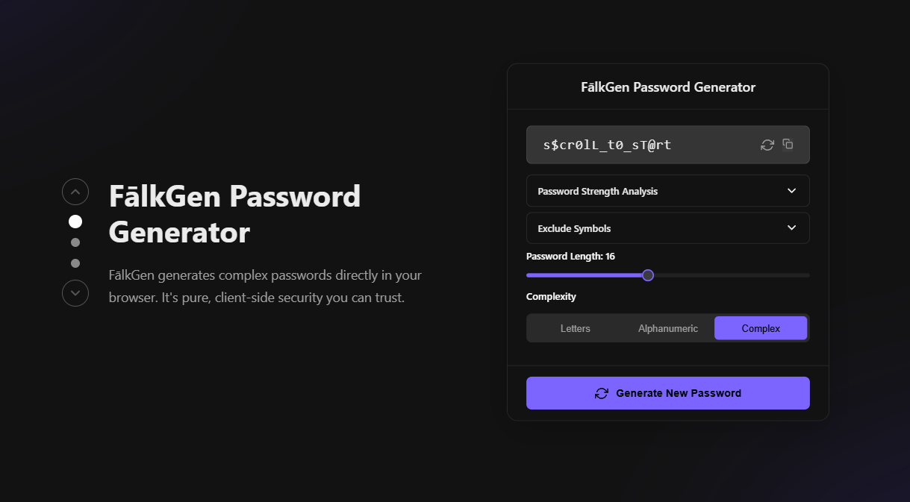

  

  <i>Pixel art by <a href="https://www.deviantart.com/pixeljeff/art/Mastermind-847156722">PixelJeff on DeviantArt</a></i>

<h3 align="center">Hi there, I'm Logan Falkenberg </h3>

  A passionate Software Engineer crafting intelligent and user-centric solutions. I hold a B.S. in Computer Science with a Minor in Mathematics from <strong>Texas State University</strong> and thrive on exploring the ever-evolving landscape of technology.

  
  
  
  

---

### 🔭 What I'm Focused On

-   🌱 **Enhancing Core Projects:** Currently refining `Stock Contender (AI)` and `Falkenberg's Password Manager`.
-   🤖 **Exploring AI/ML:** Diving deeper into neural networks, NLP, and practical machine learning applications.
-   👯 **Collaboration:** Eager to contribute to open-source projects involving AI, data analysis, or full-stack web development.

---

### ✨ My Featured Projects

<table>
  <tr valign="top">
    <td width="50%">
      <h3 align="center">Stock Contender (AI Stock Analysis)</h3>
      

        
        
Engineered a Python application to analyze market trends and financial data for stock predictions using OpenAI’s GPT API. Delivers automated daily stock picks through a user-friendly GUI.

        

          
          
          
          
        

      

    </td>
    <td width="50%">
      <h3 align="center">Falkenberg's Password Manager</h3>
      

        
        
Developed a secure, lightweight, and offline password management solution. Features XOR-based encryption, SHA-256 hashing, and a customizable theme engine built with the Qt framework.

        

          
          
          
          
        

      

    </td>
  </tr>
  <tr valign="top">
  <td colspan="2">
    <h3 align="center">FalkGen - Secure Web Password Generator</h3>
    

     
      
A sleek and secure client-side password generator built with modern web technologies. It generates strong, customizable passwords directly in your browser, ensuring no data is ever sent to a server. Hosted on Vercel.

      

        
        
         
        
        
        
        
        
      

    

  </td>
</tr>
</table>

---

### 🛠️ My Tech Arsenal

  
<strong>Languages:</strong>

  

    
    
    
    
    
    
    
  

   
  
<strong>Frameworks & Technologies:</strong>

  

    
    
    
    
    
    
  

   
  
<strong>Databases & Cloud:</strong>

  

    
    
    
    
  

   
  
<strong>Tools & Platforms:</strong>

  

    
    
    
    
    
    
    
  

---

### 📊 My GitHub Stats & Activity

  
  
  <table>
    <tr valign="top">
      <td>
        
      </td>
      <td>
        
      </td>
    </tr>
  </table>
   

  

    
  

