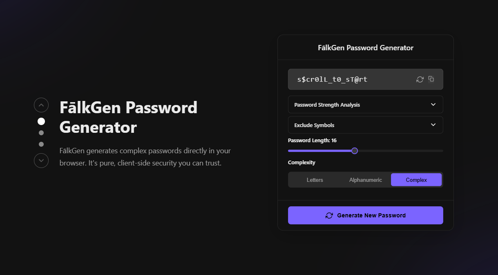

<p align="center">
  
</p>

<p align="center">
  <a href="https://readme-typing-svg.demolab.com">
    
  </a>
</p>

<p align="center">
  <a href="https://loganfalkenberg.com" target="_blank">
    
  </a>
  &nbsp;
  <a href="https://www.falkgen.com" target="_blank">
    
  </a>
  &nbsp;
  <a href="https://www.linkedin.com/in/logan-falkenberg/" target="_blank">
    
  </a>
  &nbsp;
  <a href="mailto:loganf0101@gmail.com">
    
  </a>
</p>

<p align="center">
  
</p>

---

## 👨‍💻 About Me

```python
class Logan:
    name         = "Logan Falkenberg"
    role         = "Software Engineer @ Qvest US"
    education    = "B.S. Computer Science + Minor in Mathematics | GPA: 3.8 | Dean's List"
    location     = "Austin, TX"
    interests    = ["AI Integration", "Full-Stack Engineering", "LLM-Powered Apps", "Performance Optimization"]
    stack        = ["TypeScript", "JavaScript", "Python", "Java", "C++", "C#", "React", "Next.js"]
    ai_tools     = ["OpenAI API", "Agents", "AI-Powered Workflows"]
    currently    = "Building scalable full-stack features & integrating AI into real products"
    ask_me_about = ["AI/LLM Integration", "Next.js", "API Design", "Headless CMS", "Performance Tuning"]
```

---

## 💼 Work Experience

<table width="100%">
  <tr valign="top">
    <td width="50%">
      <h3>🏢 Qvest US — Software Engineer</h3>
      <p><em>August 2025 – Present</em></p>
      <ul>
        <li>Building and maintaining full-stack features across frontend and backend systems, including secure APIs, authentication flows, and third-party integrations.</li>
        <li>Reduced API payload size by <strong>50%</strong> and improved response latency by <strong>43%</strong> by eliminating over-fetching and optimizing query patterns in an enterprise application.</li>
      </ul>
    </td>
    <td width="50%">
      <h3>🥷 Code Ninjas — Lead Instructor</h3>
      <p><em>March 2019 – July 2025</em></p>
      <ul>
        <li>Led a 10+ member team teaching coding to <strong>1,000+ students</strong>, enabling them to build applications and games in JavaScript, Lua, and C#.</li>
      </ul>
    </td>
  </tr>
</table>

---

## 🚀 Featured Projects

<table>
  <tr valign="top">
    <td width="50%">
      <h3 align="center">✍️ Robert Falkenberg — Author Website</h3>
      <div align="center">
        <br/>
        <p>Migrated a legacy WordPress site to a modern <strong>Next.js</strong> architecture using server and client components for improved performance, scalability, and maintainability. Powered by <strong>Contentful</strong> as a headless CMS.</p>
        <p>
          
          
          
          
        </p>
        
      </div>
    </td>
    <td width="50%">
      <h3 align="center">📈 Stock Contender</h3>
      <div align="center">
        <a href="https://github.com/TheTallProgrammer/Stock-Contender-App" target="_blank">
          
        </a>
        <br/><br/>
        <p>AI-powered Python application that analyzes market trends and financial data using <strong>OpenAI's GPT API</strong> to deliver automated daily stock picks through a user-friendly GUI.</p>
        <p>
          
          
          
          
        </p>
        <a href="https://github.com/TheTallProgrammer/Stock-Contender-App">
          
        </a>
      </div>
    </td>
  </tr>
  <tr valign="top">
    <td width="50%">
      <h3 align="center">🌐 FalkGen — Password Generator</h3>
      <div align="center">
        <a href="https://www.falkgen.com" target="_blank">
          
        </a>
        <br/><br/>
        <p>Sleek, client-side password generator built with Next.js. Generates strong, customizable passwords <strong>entirely in the browser</strong> — no data ever leaves your device. Deployed on Vercel.</p>
        <p>
          
          
          
          
        </p>
        <a href="https://www.falkgen.com">
          
        </a>
        &nbsp;
        
      </div>
    </td>
    <td width="50%">
      <h3 align="center">🔐 Password Manager</h3>
      <div align="center">
        <a href="https://github.com/TheTallProgrammer/Password-Manager" target="_blank">
          
        </a>
        <br/><br/>
        <p>Secure, lightweight, fully <strong>offline</strong> password manager featuring XOR-based encryption, SHA-256 hashing, and a customizable theme engine — built natively with C++ and Qt.</p>
        <p>
          
          
          
          
        </p>
        <a href="https://github.com/TheTallProgrammer/Password-Manager">
          
        </a>
      </div>
    </td>
  </tr>
</table>

---

## 🛠️ Tech Stack

<div align="center">

**Languages**


**Frameworks & Libraries**


**Databases & Cloud**


**Tools & Platforms**


</div>

---

## 📊 GitHub Stats

<div align="center">
  
</div>


---

## 🏆 GitHub Trophies

<div align="center">
  
</div>


---

<p align="center">
  
</p>
